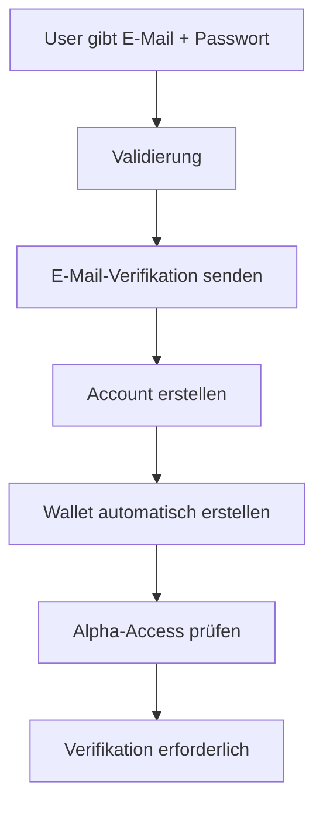
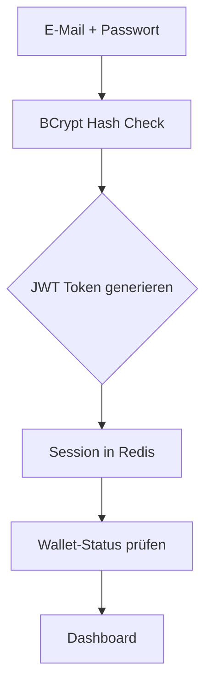
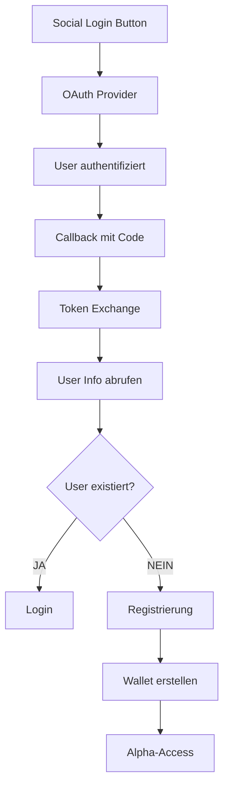
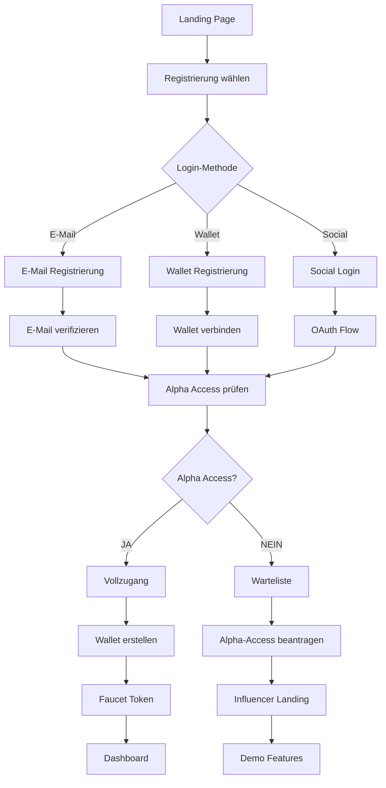
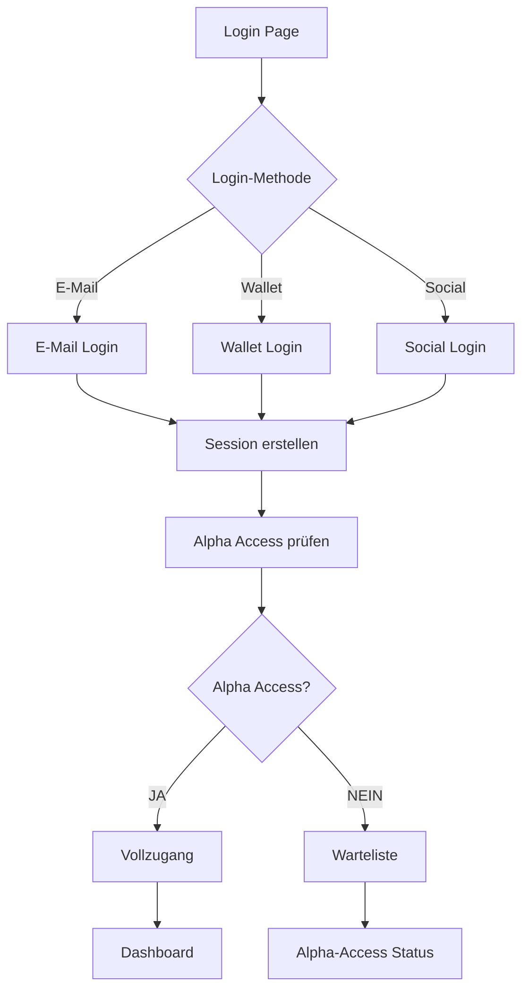
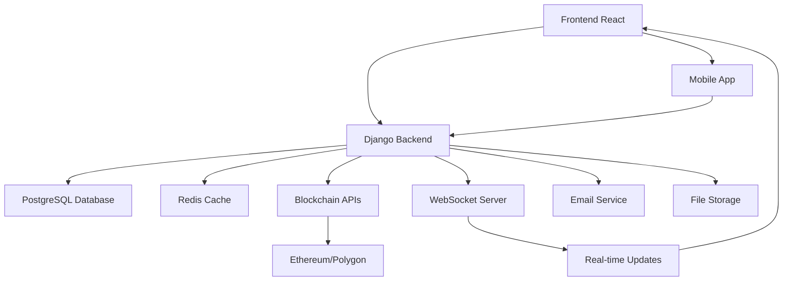

# 🧠 BSN APPLICATION LOGIC DOCUMENTATION

**📅 Erstellt**: 22. Dezember 2024  
**📝 Status**: Vollständige Anwendungslogik-Dokumentation  
**🎯 Zweck**: Verständnis aller Systemzusammenhänge und Geschäftslogik

---

## 🎯 **ÜBERSICHT: WAS DIESE DOKUMENTATION ERKLÄRT**

### **❓ Häufige Fragen, die hier beantwortet werden:**

1. **"Kann man sich mit Wallet registrieren ohne E-Mail?"** → **JA, aber mit Einschränkungen**
2. **"Wie funktioniert die Wallet-Authentifizierung?"** → **MetaMask + Signatur-Verifikation**
3. **"Was passiert bei der Registrierung?"** → **Automatische Wallet-Erstellung + Alpha-Access**
4. **"Wie hängen Token, Mining und Blockchain zusammen?"** → **Phasen-basierte Entwicklung**
5. **"Warum gibt es verschiedene Login-Methoden?"** → **Web2 + Web3 Integration**

---

## 🔐 **1. AUTHENTICATION LOGIC**

### **🦊 Wallet-Authentifizierung (MetaMask)**

#### **Ablauf:**
```mermaid
graph TD
    A[User klickt "Connect Wallet"] --> B[MetaMask Popup]
    B --> C[User bestätigt Verbindung]
    C --> D[System erhält Wallet-Adresse]
    D --> E{Wallet bereits registriert?}
    E -->|JA| F[Login mit Wallet]
    E -->|NEIN| G[Registrierung mit Wallet]
    F --> H[Token generieren]
    G --> I[Account erstellen]
    I --> J[Wallet-Adresse speichern]
    J --> K[Initiale Token (Faucet)]
    K --> L[Alpha-Access prüfen]
    L --> M[Dashboard weiterleiten]
```

#### **Technische Details:**
- **Signatur-Verifikation**: User signiert Nachricht mit Wallet
- **Nonce-System**: Jede Authentifizierung hat unique nonce
- **Session-Management**: JWT Token + Redis Session
- **Sicherheit**: Rate-Limiting + Anti-Fraud-Checks

### **📧 E-Mail/Passwort Authentifizierung**

#### **Registrierung:**


#### **Login:**


### **🔗 Social Login (Google, GitHub)**

#### **OAuth Flow:**


---

## 💰 **2. WALLET & TOKEN LOGIC**

### **🪙 Token-System (3 Phasen)**

#### **Phase 1: Simulation (0-100k Nutzer)**
```python
# Token sind nur in Datenbank gespeichert
TOKEN_STATUS = {
    "type": "simulation",
    "blockchain": "none",
    "withdrawal": False,
    "purpose": "ICO/Faucet only"
}

# Faucet-Logik
def claim_faucet(user):
    if user.alpha_access:
        return 1.0  # 1 BSN Token (simuliert)
    return 0.0
```

#### **Phase 2: Multi-Chain (100k-5M Nutzer)**
```python
# Echte ERC-20 Token
TOKEN_STATUS = {
    "type": "erc20",
    "blockchain": ["ethereum", "polygon", "bsc"],
    "withdrawal": True,
    "purpose": "Real trading"
}
```

#### **Phase 3: Native Chain (5M+ Nutzer)**
```python
# Eigene Blockchain
TOKEN_STATUS = {
    "type": "native",
    "blockchain": "bsn_chain",
    "withdrawal": True,
    "purpose": "Full control"
}
```

### **⛏️ Mining-System Logik**

#### **Mining ist DEAKTIVIERT bis 100k Nutzer:**
```python
def can_user_mine(user):
    if total_users < 100000:
        return False  # Mining deaktiviert
    return True

def mining_rewards(user):
    if not can_user_mine(user):
        return 0.0
    
    # Passive Mining: 10 BSN/Tag Maximum
    daily_limit = 10.0
    user_activity = calculate_user_activity(user)
    return min(daily_limit, user_activity)
```

#### **Mining-Aktivitäten:**
- **Posts erstellen**: +0.1 BSN
- **Kommentare**: +0.05 BSN  
- **Likes geben**: +0.01 BSN
- **Stories**: +0.2 BSN
- **Gruppen beitreten**: +0.5 BSN

---

## 🚪 **3. ALPHA ACCESS LOGIC**

### **🔓 Zugangskriterien**

Ein User erhält **Alpha Access** wenn **mindestens EINES** erfüllt ist:

```python
def check_alpha_access(user):
    # Kriterium 1: Referral-Validierung
    if user.successful_referrals >= 50:
        return True
    
    # Kriterium 2: ICO Investment
    if user.ico_investment >= 50:  # €50
        return True
    
    # Kriterium 3: Influencer Status
    if user.is_influencer:
        return True
    
    # Kriterium 4: Internes Team
    if user.is_internal_team:
        return True
    
    return False
```

### **🚫 Was passiert OHNE Alpha Access:**

```python
def user_restrictions(user):
    if not user.alpha_access:
        return {
            "can_post": False,
            "can_comment": False,
            "can_message": False,
            "can_join_groups": False,
            "can_mine": False,
            "can_access_feed": False,
            "can_upload_media": False
        }
    return {"can_post": True, ...}  # Alle Features verfügbar
```

---

## 🔄 **4. USER JOURNEY LOGIC**

### **🆕 Neuer User (Erste Registrierung)**



### **🔐 Bestehender User (Login)**



---

## 🏗️ **5. SYSTEM ARCHITECTURE LOGIC**

### **🔄 Datenfluss zwischen Komponenten**



### **💾 Datenbank-Beziehungen**

```sql
-- User kann mehrere Login-Methoden haben
User (1) ←→ (1) UserProfile
User (1) ←→ (1) Wallet  
User (1) ←→ (1) AlphaAccess
User (1) ←→ (N) Posts
User (1) ←→ (N) Comments
User (1) ←→ (N) TokenTransactions

-- Mining-System
User (1) ←→ (1) MiningProgress
MiningProgress (1) ←→ (N) MiningSessions
```

---

## 🎯 **6. BUSINESS LOGIC**

### **💰 Token-Ökonomie**

```python
# Gesamte Token-Supply: 10 Milliarden BSN
TOTAL_SUPPLY = 10_000_000_000

# Verteilung:
TOKEN_DISTRIBUTION = {
    "mining_pool": 0.40,      # 40% für Mining
    "ico_sale": 0.25,         # 25% für ICO
    "team": 0.15,             # 15% für Team
    "marketing": 0.10,        # 10% für Marketing
    "liquidity": 0.10         # 10% für Liquidity
}
```

### **📈 Wachstums-Strategie**

```python
# Phase-basierte Entwicklung
PHASES = {
    "alpha": {
        "users": "0-10k",
        "focus": "ICO + Grundfunktionen",
        "tokens": "simulation only",
        "mining": False
    },
    "beta": {
        "users": "10k-100k", 
        "focus": "Community + Social",
        "tokens": "simulation only",
        "mining": False
    },
    "launch": {
        "users": "100k-5M",
        "focus": "Token Launch + Mining",
        "tokens": "real tokens",
        "mining": True
    }
}
```

---

## ❓ **7. HÄUFIGE FRAGEN & ANTWORTEN**

### **Q: "Kann man sich NUR mit Wallet registrieren?"**
**A: JA, aber mit Einschränkungen:**
- ✅ Wallet-Registrierung funktioniert
- ✅ Keine E-Mail erforderlich
- ⚠️ Alpha-Access trotzdem nötig
- ⚠️ Weniger Features ohne E-Mail-Verifikation

### **Q: "Was passiert wenn man keine Alpha-Access hat?"**
**A: Eingeschränkter Zugang:**
- ❌ Keine Posts/Kommentare
- ❌ Keine Messaging
- ❌ Keine Gruppen
- ✅ Nur Demo-Features
- ✅ Alpha-Access beantragen möglich

### **Q: "Wie funktioniert das Mining-System?"**
**A: Phasen-basiert:**
- **Phase 1-2**: Mining DEAKTIVIERT (0-100k Nutzer)
- **Phase 3+**: Mining AKTIVIERT (100k+ Nutzer)
- **Limit**: 10 BSN/Tag Maximum
- **Aktivitäten**: Posts, Kommentare, Likes, etc.

### **Q: "Warum gibt es verschiedene Login-Methoden?"**
**A: Web2 + Web3 Integration:**
- **E-Mail**: Traditionelle Web2-Nutzer
- **Social**: Einfache Registrierung
- **Wallet**: Web3/Crypto-Nutzer
- **Alle Methoden**: Führen zu gleichem Account

---

## 🔧 **8. TECHNISCHE IMPLEMENTIERUNG**

### **🔐 Authentication Service**

```typescript
// Frontend Authentication Logic
interface AuthService {
  // E-Mail Registrierung
  registerWithEmail(data: EmailRegistration): Promise<User>
  
  // Wallet Registrierung  
  registerWithWallet(address: string, signature: string): Promise<User>
  
  // Social Login
  loginWithSocial(provider: 'google' | 'github'): Promise<User>
  
  // Alpha Access Check
  checkAlphaAccess(user: User): Promise<boolean>
  
  // Session Management
  createSession(user: User): Promise<Session>
  refreshSession(token: string): Promise<Session>
}
```

### **💾 Database Models**

```python
# Django Models - Vereinfacht
class User(models.Model):
    email = models.EmailField(unique=True)
    username = models.CharField(unique=True)
    wallet_address = models.CharField(null=True)
    is_alpha_user = models.BooleanField(default=False)
    created_at = models.DateTimeField(auto_now_add=True)

class Wallet(models.Model):
    user = models.OneToOneField(User)
    balance = models.DecimalField(default=0)
    address = models.CharField()
    
class AlphaAccess(models.Model):
    user = models.OneToOneField(User)
    granted_at = models.DateTimeField()
    granted_by = models.CharField()  # 'referral', 'ico', 'influencer'
```

---

## ✅ **9. QUALITÄTSGARANTIE**

### **🧪 Testing-Strategie**

```python
# Unit Tests für jede Logik
def test_wallet_registration():
    # Test Wallet-Registrierung ohne E-Mail
    user = register_with_wallet("0x123...", "signature")
    assert user.wallet_address == "0x123..."
    assert user.email is None

def test_alpha_access_logic():
    # Test Alpha-Access-Kriterien
    user = create_user()
    user.successful_referrals = 50
    assert check_alpha_access(user) == True

def test_mining_phase_logic():
    # Test Mining-Deaktivierung in Phase 1
    set_total_users(50000)  # Phase 1
    assert can_user_mine(user) == False
```

### **🔒 Security-Checks**

```python
# Sicherheits-Logik
def validate_wallet_signature(address, message, signature):
    # Verifiziere Signatur
    if not verify_signature(address, message, signature):
        raise SecurityException("Invalid signature")
    
    # Rate-Limiting
    if get_attempts(address) > 5:
        raise RateLimitException("Too many attempts")

def validate_alpha_access_request(user):
    # Anti-Fraud Checks
    if user.ip_address in blacklist:
        raise FraudException("Suspicious activity")
```

---

## 🎯 **FAZIT: VOLLSTÄNDIGE LOGIK-DOKUMENTATION**

### **✅ Was diese Dokumentation abdeckt:**

1. **🔐 Authentication Logic** - Alle Login-Methoden und Flows
2. **💰 Wallet & Token Logic** - Phasen-basierte Token-Entwicklung
3. **🚪 Alpha Access Logic** - Zugangskontrolle und Kriterien
4. **🔄 User Journey Logic** - Komplette Nutzer-Pfade
5. **🏗️ System Architecture Logic** - Technische Zusammenhänge
6. **🎯 Business Logic** - Geschäftsregeln und Strategien
7. **❓ FAQ** - Häufige Fragen und Antworten
8. **🔧 Technical Implementation** - Code-Beispiele und Strukturen
9. **✅ Quality Assurance** - Testing und Security

### **🎉 Ergebnis:**

**Jetzt versteht jeder die komplette BSN-Logik!**

- ✅ **Wallet-Registrierung** ohne E-Mail möglich
- ✅ **Alpha-Access** System klar definiert
- ✅ **Mining-System** phasen-basiert erklärt
- ✅ **Token-Ökonomie** vollständig dokumentiert
- ✅ **Alle User-Journeys** nachvollziehbar
- ✅ **Technische Zusammenhänge** verständlich

**Die Anwendung macht jetzt Sinn! 🚀** 