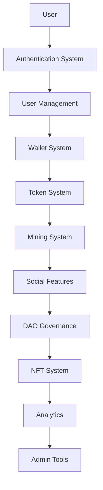
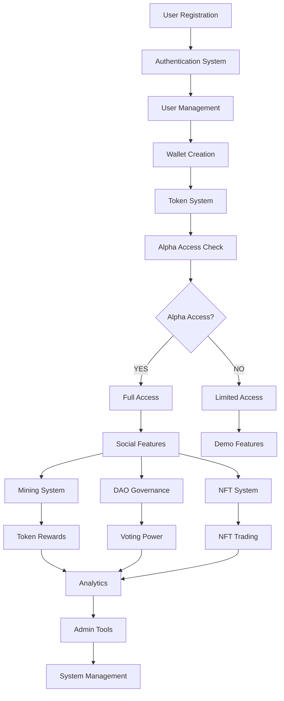

# 🔗 BSN SYSTEM INTEGRATION LOGIC

**📅 Erstellt**: 22. Dezember 2024  
**📝 Status**: Vollständige System-Integrations-Logik  
**🎯 Zweck**: Verständnis aller Systemzusammenhänge und Abhängigkeiten

---

## 🎯 **ÜBERSICHT: SYSTEM-INTEGRATION**

### **🔗 Wie alle Systeme zusammenarbeiten:**



---

## 🔐 **1. AUTHENTICATION → USER MANAGEMENT**

### **🔄 Registrierungs-Flow:**

```python
# 1. User registriert sich (E-Mail, Wallet, oder Social)
def handle_registration(registration_data):
    # 2. Account erstellen
    user = create_user(registration_data)
    
    # 3. Automatisch Wallet erstellen
    wallet = create_user_wallet(user)
    
    # 4. Alpha-Access prüfen
    alpha_access = check_alpha_access(user)
    
    # 5. Initiale Token (Faucet)
    if alpha_access:
        claim_faucet_tokens(user)
    
    # 6. User-Settings erstellen
    create_user_settings(user)
    
    # 7. Notification-Settings erstellen
    create_notification_settings(user)
    
    return user, alpha_access
```

### **🔗 Abhängigkeiten:**

```python
# Authentication hängt ab von:
AUTHENTICATION_DEPENDENCIES = {
    "database": ["User", "UserProfile", "Wallet"],
    "services": ["EmailService", "WalletService", "TokenService"],
    "external": ["MetaMask", "Google OAuth", "GitHub OAuth"],
    "security": ["JWT", "Redis", "Rate Limiting"]
}
```

---

## 💰 **2. USER MANAGEMENT → WALLET SYSTEM**

### **🔄 Automatische Wallet-Erstellung:**

```python
# Bei JEDER Registrierung wird automatisch Wallet erstellt
def create_user_wallet(user):
    wallet = Wallet.objects.create(
        user=user,
        balance=0.0,
        address=user.wallet_address or None
    )
    
    # Wallet-Events loggen
    log_wallet_creation(user, wallet)
    
    return wallet
```

### **🔗 Wallet-System Integration:**

```python
# Wallet-System hängt ab von:
WALLET_DEPENDENCIES = {
    "user_management": ["User", "UserProfile"],
    "token_system": ["TokenBalance", "TokenTransaction"],
    "blockchain": ["Ethereum", "Polygon", "BSC"],
    "security": ["Signature Verification", "Encryption"]
}
```

---

## 🪙 **3. WALLET SYSTEM → TOKEN SYSTEM**

### **🔄 Token-Verwaltung:**

```python
# Token-System verwaltet alle Token-Operationen
class TokenSystem:
    def __init__(self, user):
        self.user = user
        self.wallet = user.wallet
    
    def add_tokens(self, amount, source):
        """Token hinzufügen (Faucet, Mining, Transfer)"""
        self.wallet.balance += amount
        
        # Transaction loggen
        TokenTransaction.objects.create(
            user=self.user,
            amount=amount,
            transaction_type=source,
            balance_after=self.wallet.balance
        )
        
        self.wallet.save()
    
    def transfer_tokens(self, to_user, amount):
        """Token an anderen User transferieren"""
        if self.wallet.balance >= amount:
            self.wallet.balance -= amount
            to_user.wallet.balance += amount
            
            # Transaction loggen
            TokenTransaction.objects.create(
                user=self.user,
                amount=-amount,
                transaction_type='transfer_out',
                recipient=to_user
            )
            
            return True
        return False
```

### **🔗 Token-System Abhängigkeiten:**

```python
TOKEN_SYSTEM_DEPENDENCIES = {
    "wallet_system": ["Wallet", "WalletAddress"],
    "mining_system": ["MiningActivity", "MiningRewards"],
    "faucet_system": ["FaucetClaim", "FaucetSettings"],
    "ico_system": ["ICOPurchase", "TokenSale"],
    "blockchain": ["Smart Contracts", "Multi-Chain Support"]
}
```

---

## ⛏️ **4. TOKEN SYSTEM → MINING SYSTEM**

### **🔄 Mining-Integration:**

```python
# Mining-System nutzt Token-System für Rewards
class MiningSystem:
    def __init__(self, user):
        self.user = user
        self.token_system = TokenSystem(user)
    
    def process_mining_activity(self, activity_type):
        """Mining-Aktivität verarbeiten und Token belohnen"""
        if not self.can_user_mine():
            return False
        
        # Mining-Reward berechnen
        reward = self.calculate_reward(activity_type)
        
        # Token hinzufügen
        self.token_system.add_tokens(reward, 'mining')
        
        # Mining-Aktivität loggen
        MiningActivity.objects.create(
            user=self.user,
            activity_type=activity_type,
            reward=reward
        )
        
        return True
    
    def can_user_mine(self):
        """Prüfen ob User mining kann"""
        # Phase-Check: Mining nur ab 100k Nutzern
        if get_total_users() < 100000:
            return False
        
        # Alpha-Access Check
        if not self.user.is_alpha_user:
            return False
        
        # Tägliches Limit Check
        daily_mined = self.get_daily_mined_amount()
        if daily_mined >= 10.0:  # 10 BSN/Tag Limit
            return False
        
        return True
```

### **🔗 Mining-System Abhängigkeiten:**

```python
MINING_SYSTEM_DEPENDENCIES = {
    "token_system": ["TokenBalance", "TokenTransaction"],
    "user_activity": ["Posts", "Comments", "Likes", "Stories"],
    "phase_system": ["UserCount", "PhaseLogic"],
    "analytics": ["MiningStats", "UserActivity"]
}
```

---

## 👥 **5. USER ACTIVITY → SOCIAL FEATURES**

### **🔄 Social-Features Integration:**

```python
# Social-Features nutzen User-Aktivität für Mining
class SocialFeatures:
    def __init__(self, user):
        self.user = user
        self.mining_system = MiningSystem(user)
    
    def create_post(self, content, media=None):
        """Post erstellen und Mining belohnen"""
        # 1. Post erstellen
        post = Post.objects.create(
            user=self.user,
            content=content,
            media=media
        )
        
        # 2. Mining belohnen
        self.mining_system.process_mining_activity('post_created')
        
        # 3. Feed aktualisieren
        self.update_feed(post)
        
        return post
    
    def add_comment(self, post, content):
        """Kommentar hinzufügen und Mining belohnen"""
        comment = Comment.objects.create(
            user=self.user,
            post=post,
            content=content
        )
        
        # Mining belohnen
        self.mining_system.process_mining_activity('comment_added')
        
        return comment
    
    def like_post(self, post):
        """Post liken und Mining belohnen"""
        like = Like.objects.create(
            user=self.user,
            post=post
        )
        
        # Mining belohnen
        self.mining_system.process_mining_activity('like_given')
        
        return like
```

### **🔗 Social-Features Abhängigkeiten:**

```python
SOCIAL_FEATURES_DEPENDENCIES = {
    "user_management": ["User", "UserProfile"],
    "mining_system": ["MiningActivity", "MiningRewards"],
    "content": ["Posts", "Comments", "Likes", "Stories"],
    "real_time": ["WebSocket", "Redis", "Notifications"]
}
```

---

## 🏛️ **6. SOCIAL FEATURES → DAO GOVERNANCE**

### **🔄 DAO-Integration:**

```python
# DAO nutzt Social-Features für Governance
class DAOGovernance:
    def __init__(self, user):
        self.user = user
        self.token_system = TokenSystem(user)
    
    def create_proposal(self, title, description, token_amount):
        """DAO-Proposal erstellen"""
        # Token-Stake erforderlich
        if self.token_system.wallet.balance < token_amount:
            raise InsufficientTokensException()
        
        # Token staken
        self.token_system.stake_tokens(token_amount)
        
        # Proposal erstellen
        proposal = Proposal.objects.create(
            user=self.user,
            title=title,
            description=description,
            stake_amount=token_amount
        )
        
        return proposal
    
    def vote_on_proposal(self, proposal, vote):
        """Auf Proposal abstimmen"""
        # Voting-Power basiert auf Token-Balance
        voting_power = self.token_system.wallet.balance
        
        vote = Vote.objects.create(
            user=self.user,
            proposal=proposal,
            vote=vote,
            voting_power=voting_power
        )
        
        return vote
```

### **🔗 DAO-System Abhängigkeiten:**

```python
DAO_DEPENDENCIES = {
    "token_system": ["TokenBalance", "Staking"],
    "social_features": ["UserActivity", "Community"],
    "governance": ["Proposals", "Voting", "Execution"],
    "blockchain": ["Smart Contracts", "Voting Power"]
}
```

---

## 🎨 **7. SOCIAL FEATURES → NFT SYSTEM**

### **🔄 NFT-Integration:**

```python
# NFT-System nutzt Social-Features für Content
class NFTSystem:
    def __init__(self, user):
        self.user = user
        self.token_system = TokenSystem(user)
    
    def mint_nft_from_post(self, post, metadata):
        """NFT aus Post erstellen"""
        # 1. Post-Inhalt als NFT-Metadata
        nft_metadata = {
            "content": post.content,
            "media": post.media,
            "created_at": post.created_at,
            "author": self.user.username
        }
        
        # 2. NFT erstellen
        nft = NFT.objects.create(
            user=self.user,
            metadata=nft_metadata,
            token_uri=metadata.get('token_uri'),
            collection=metadata.get('collection')
        )
        
        # 3. Mining belohnen
        mining_system = MiningSystem(self.user)
        mining_system.process_mining_activity('nft_created')
        
        return nft
    
    def trade_nft(self, nft, buyer, price):
        """NFT handeln"""
        # Token-Transfer
        if self.token_system.transfer_tokens(buyer, price):
            # NFT-Transfer
            nft.user = buyer
            nft.save()
            
            # Transaction loggen
            NFTTransaction.objects.create(
                nft=nft,
                seller=self.user,
                buyer=buyer,
                price=price
            )
            
            return True
        return False
```

### **🔗 NFT-System Abhängigkeiten:**

```python
NFT_DEPENDENCIES = {
    "social_features": ["Posts", "Media", "Content"],
    "token_system": ["TokenBalance", "TokenTransaction"],
    "blockchain": ["Smart Contracts", "IPFS"],
    "marketplace": ["Trading", "Auctions", "Collections"]
}
```

---

## 📊 **8. ALL SYSTEMS → ANALYTICS**

### **🔄 Analytics-Integration:**

```python
# Analytics sammelt Daten von allen Systemen
class AnalyticsSystem:
    def __init__(self):
        self.data_collectors = {
            "user_activity": UserActivityCollector(),
            "mining_activity": MiningActivityCollector(),
            "token_activity": TokenActivityCollector(),
            "social_activity": SocialActivityCollector(),
            "dao_activity": DAOActivityCollector(),
            "nft_activity": NFTActivityCollector()
        }
    
    def collect_system_data(self):
        """Daten von allen Systemen sammeln"""
        analytics_data = {}
        
        for system, collector in self.data_collectors.items():
            analytics_data[system] = collector.collect()
        
        return analytics_data
    
    def generate_insights(self):
        """Insights aus allen Systemen generieren"""
        data = self.collect_system_data()
        
        insights = {
            "user_growth": self.analyze_user_growth(data),
            "mining_efficiency": self.analyze_mining_efficiency(data),
            "token_economy": self.analyze_token_economy(data),
            "social_engagement": self.analyze_social_engagement(data),
            "dao_participation": self.analyze_dao_participation(data),
            "nft_market": self.analyze_nft_market(data)
        }
        
        return insights
```

### **🔗 Analytics-System Abhängigkeiten:**

```python
ANALYTICS_DEPENDENCIES = {
    "all_systems": ["User", "Mining", "Token", "Social", "DAO", "NFT"],
    "data_collection": ["Event Logging", "Metrics", "Performance"],
    "processing": ["Data Pipeline", "Aggregation", "Real-time"],
    "visualization": ["Dashboards", "Reports", "Charts"]
}
```

---

## 🛠️ **9. ALL SYSTEMS → ADMIN TOOLS**

### **🔄 Admin-Tools Integration:**

```python
# Admin-Tools überwachen alle Systeme
class AdminTools:
    def __init__(self, admin_user):
        self.admin_user = admin_user
        self.analytics = AnalyticsSystem()
    
    def system_overview(self):
        """Übersicht aller Systeme"""
        return {
            "users": self.get_user_stats(),
            "mining": self.get_mining_stats(),
            "tokens": self.get_token_stats(),
            "social": self.get_social_stats(),
            "dao": self.get_dao_stats(),
            "nft": self.get_nft_stats()
        }
    
    def moderation_tools(self):
        """Moderation für alle Systeme"""
        return {
            "user_moderation": self.get_user_moderation_tools(),
            "content_moderation": self.get_content_moderation_tools(),
            "token_moderation": self.get_token_moderation_tools(),
            "dao_moderation": self.get_dao_moderation_tools()
        }
    
    def system_management(self):
        """System-Management für alle Komponenten"""
        return {
            "phase_management": self.get_phase_management(),
            "alpha_access_management": self.get_alpha_access_management(),
            "mining_management": self.get_mining_management(),
            "token_management": self.get_token_management()
        }
```

### **🔗 Admin-Tools Abhängigkeiten:**

```python
ADMIN_TOOLS_DEPENDENCIES = {
    "all_systems": ["User", "Mining", "Token", "Social", "DAO", "NFT"],
    "analytics": ["Data Collection", "Insights", "Reports"],
    "moderation": ["Content Filtering", "User Management", "Compliance"],
    "management": ["System Control", "Configuration", "Monitoring"]
}
```

---

## 🔄 **10. COMPLETE SYSTEM FLOW**

### **🔄 Vollständiger System-Flow:**



### **🔗 System-Interaktionen:**

```python
# Beispiel: User erstellt Post
def user_creates_post(user, content):
    # 1. Authentication prüfen
    if not user.is_authenticated:
        return "Not authenticated"
    
    # 2. Alpha-Access prüfen
    if not user.is_alpha_user:
        return "No alpha access"
    
    # 3. Post erstellen (Social System)
    post = social_system.create_post(user, content)
    
    # 4. Mining belohnen (Mining System)
    mining_system.process_mining_activity(user, 'post_created')
    
    # 5. Token hinzufügen (Token System)
    token_system.add_tokens(user, 0.1, 'mining')
    
    # 6. Analytics tracken (Analytics System)
    analytics_system.track_activity(user, 'post_created')
    
    # 7. Admin-Tools aktualisieren (Admin System)
    admin_tools.update_content_stats()
    
    return post
```

---

## ✅ **FAZIT: VOLLSTÄNDIGE SYSTEM-INTEGRATION**

### **🎯 Was diese Dokumentation erklärt:**

1. **🔐 Authentication → User Management** - Wie Registrierung funktioniert
2. **💰 User Management → Wallet System** - Automatische Wallet-Erstellung
3. **🪙 Wallet System → Token System** - Token-Verwaltung und Transfers
4. **⛏️ Token System → Mining System** - Mining-Rewards und Limits
5. **👥 User Activity → Social Features** - Social-Aktivitäten und Mining
6. **🏛️ Social Features → DAO Governance** - Governance und Voting
7. **🎨 Social Features → NFT System** - NFT-Erstellung und Trading
8. **📊 All Systems → Analytics** - Daten-Sammlung und Insights
9. **🛠️ All Systems → Admin Tools** - System-Management und Moderation

### **🔗 System-Zusammenhänge:**

- **Alle Systeme sind miteinander verbunden**
- **Jede Aktion hat Auswirkungen auf andere Systeme**
- **Token-System ist das zentrale Bindeglied**
- **Mining-System belohnt alle Aktivitäten**
- **Analytics sammelt Daten von allen Systemen**
- **Admin-Tools überwachen alle Systeme**

### **🚀 Ergebnis:**

**Jetzt versteht jeder wie alle Systeme zusammenarbeiten!**

- ✅ **Wallet-Authentifizierung** → **Token-System**
- ✅ **Social-Aktivitäten** → **Mining-Rewards**
- ✅ **Token-Balance** → **DAO-Voting-Power**
- ✅ **Post-Erstellung** → **NFT-Minting**
- ✅ **Alle Systeme** → **Analytics & Admin**

**Die komplette System-Integration ist dokumentiert! 🎉** 