# 🔓 BSN Early Access & Zugangsbeschränkung Strategie

## 🎯 Überblick
**Ziel**: Exklusive Zugangsbeschränkung während Alpha/Beta-Phase für gezieltes Feedback und Marketing durch Multiplikatoren.

## 📊 Zugangsberechtigung (Alpha/Testzugang)

### ✅ Kriterien für Alpha-Zugang
Ein Nutzer erhält Zugang zur Hauptplattform während Alpha/Closed-Beta, wenn **mindestens eines** der folgenden Kriterien erfüllt ist:

#### 1. **Referral-Validierung** (50+ erfolgreiche Einladungen)
```python
REFERRAL_CRITERIA = {
    "min_referrals": 50,
    "successful_registrations": True,
    "email_verified": True,
    "active_status": True
}
```

#### 2. **ICO/Pre-Sale Investment** (Mindestinvestition)
```python
INVESTMENT_CRITERIA = {
    "min_bsn_tokens": 200,
    "min_euro_value": 50,  # €50 Mindestinvestition
    "payment_confirmed": True
}
```

#### 3. **Influencer/Streamer Status** (Manueller Admin-Zugang)
```python
INFLUENCER_CRITERIA = {
    "category": ["crypto_streamer", "influencer", "content_creator"],
    "follower_count": 1000,  # Mindestfollower
    "manual_approval": True
}
```

#### 4. **Internes Team** (Tester/Support)
```python
INTERNAL_CRITERIA = {
    "team_member": True,
    "role": ["tester", "support", "developer", "admin"]
}
```

## 🔐 Technische Umsetzung

### Django User Model Erweiterung
```python
class User(AbstractUser):
    # ... existing fields ...
    
    # Early Access Control
    is_alpha_user = models.BooleanField(default=False)
    alpha_access_granted_at = models.DateTimeField(null=True, blank=True)
    alpha_access_granted_by = models.ForeignKey(
        'self', 
        on_delete=models.SET_NULL, 
        null=True, 
        blank=True,
        related_name='alpha_access_granted'
    )
    alpha_access_reason = models.CharField(
        max_length=50,
        choices=[
            ('referral', 'Referral Validation'),
            ('investment', 'ICO Investment'),
            ('influencer', 'Influencer Status'),
            ('internal', 'Internal Team'),
            ('manual', 'Manual Grant')
        ],
        null=True, blank=True
    )
    
    # Referral Tracking für Alpha Access
    referral_count_for_alpha = models.IntegerField(default=0)
    referral_validation_date = models.DateTimeField(null=True, blank=True)
    
    # Investment Tracking für Alpha Access
    ico_investment_amount = models.DecimalField(
        max_digits=10, 
        decimal_places=2, 
        default=0
    )
    investment_validation_date = models.DateTimeField(null=True, blank=True)
    
    # Influencer Information
    influencer_category = models.CharField(
        max_length=50,
        choices=[
            ('crypto_streamer', 'Crypto Streamer'),
            ('influencer', 'Influencer'),
            ('content_creator', 'Content Creator'),
            ('youtuber', 'YouTuber'),
            ('twitter_influencer', 'Twitter Influencer')
        ],
        null=True, blank=True
    )
    follower_count = models.IntegerField(default=0)
    social_media_links = models.JSONField(default=dict, blank=True)
    
    def can_access_alpha(self):
        """Check if user can access alpha platform."""
        return self.is_alpha_user and self.is_active
    
    def grant_alpha_access(self, reason, granted_by=None):
        """Grant alpha access to user."""
        self.is_alpha_user = True
        self.alpha_access_granted_at = timezone.now()
        self.alpha_access_granted_by = granted_by
        self.alpha_access_reason = reason
        self.save()
        
        # Send notification
        self.send_alpha_access_notification()
    
    def send_alpha_access_notification(self):
        """Send alpha access notification."""
        # Email notification
        send_alpha_access_email.delay(self.id)
        
        # Telegram invitation
        send_telegram_invitation.delay(self.id)
```

### API Endpoints für Alpha Access
```python
# Alpha Access Management API
class AlphaAccessViewSet(viewsets.ViewSet):
    permission_classes = [IsAdminUser]
    
    @action(detail=True, methods=['post'])
    def grant_access(self, request, pk=None):
        """Grant alpha access to user."""
        user = self.get_object()
        reason = request.data.get('reason')
        
        user.grant_alpha_access(reason, granted_by=request.user)
        
        return Response({
            'success': True,
            'message': f'Alpha access granted to {user.username}',
            'reason': reason
        })
    
    @action(detail=True, methods=['post'])
    def revoke_access(self, request, pk=None):
        """Revoke alpha access from user."""
        user = self.get_object()
        user.is_alpha_user = False
        user.save()
        
        return Response({
            'success': True,
            'message': f'Alpha access revoked from {user.username}'
        })
    
    @action(detail=False, methods=['get'])
    def alpha_users(self, request):
        """Get all alpha users."""
        alpha_users = User.objects.filter(is_alpha_user=True)
        serializer = UserSerializer(alpha_users, many=True)
        return Response(serializer.data)

# Public API for checking alpha access
class AlphaAccessCheckView(APIView):
    permission_classes = [IsAuthenticated]
    
    def get(self, request):
        """Check if current user has alpha access."""
        user = request.user
        
        return Response({
            'has_alpha_access': user.can_access_alpha(),
            'access_reason': user.alpha_access_reason,
            'granted_at': user.alpha_access_granted_at,
            'referral_count': user.referral_count_for_alpha,
            'investment_amount': float(user.ico_investment_amount)
        })
```

### Frontend Alpha Access Control
```jsx
// Alpha Access Guard Component
const AlphaAccessGuard = ({ children }) => {
  const { user, isAuthenticated } = useAuth()
  const { hasAlphaAccess, isLoading } = useAlphaAccessCheck()
  
  if (isLoading) {
    return <LoadingSpinner />
  }
  
  if (!isAuthenticated) {
    return <Navigate to="/login" />
  }
  
  if (!hasAlphaAccess) {
    return <AlphaAccessDenied />
  }
  
  return children
}

// Alpha Access Denied Component
const AlphaAccessDenied = () => {
  return (
    <div className="alpha-access-denied">
      <div className="access-card">
        <h2>🔒 Alpha Access Required</h2>
        <p>You need alpha access to use the BSN platform.</p>
        
        <div className="access-methods">
          <h3>How to get Alpha Access:</h3>
          
          <div className="method">
            <h4>🎯 Referral Program</h4>
            <p>Invite 50+ friends who successfully register</p>
            <ReferralProgress />
          </div>
          
          <div className="method">
            <h4>💰 ICO Investment</h4>
            <p>Invest minimum €50 in BSN tokens</p>
            <InvestmentProgress />
          </div>
          
          <div className="method">
            <h4>📺 Influencer Program</h4>
            <p>Apply as content creator/influencer</p>
            <InfluencerApplication />
          </div>
        </div>
      </div>
    </div>
  )
}
```

## 👨‍💻 Influencer & Streamer Integration

### Influencer Landing Page
```jsx
// Influencer Landing Page
const InfluencerLanding = () => {
  return (
    <div className="influencer-landing">
      <HeroSection>
        <h1>Join BSN as an Influencer</h1>
        <p>Get early access to the future of social media</p>
      </HeroSection>
      
      <BenefitsSection>
        <h2>Exclusive Benefits</h2>
        <ul>
          <li>🎯 Early Alpha Access</li>
          <li>💰 Unique Referral Rewards</li>
          <li>🎨 Custom Demo Tokens</li>
          <li>📊 Analytics Dashboard</li>
          <li>🤝 Direct Support</li>
        </ul>
      </BenefitsSection>
      
      <ApplicationForm>
        <InfluencerApplicationForm />
      </ApplicationForm>
      
      <DemoSection>
        <h2>Demo Materials</h2>
        <DemoWidget />
        <DemoTokens />
        <StreamingOverlays />
      </DemoSection>
    </div>
  )
}

// Influencer Application Form
const InfluencerApplicationForm = () => {
  const [formData, setFormData] = useState({
    name: '',
    email: '',
    category: '',
    follower_count: '',
    social_links: {},
    content_description: '',
    why_join: ''
  })
  
  const handleSubmit = async (e) => {
    e.preventDefault()
    
    try {
      const response = await apiService.influencer.apply(formData)
      
      if (response.success) {
        showToast('Application submitted successfully!', 'success')
      }
    } catch (error) {
      showToast('Application failed. Please try again.', 'error')
    }
  }
  
  return (
    <form onSubmit={handleSubmit} className="influencer-form">
      <FormField label="Name" required>
        <Input 
          value={formData.name}
          onChange={(e) => setFormData({...formData, name: e.target.value})}
        />
      </FormField>
      
      <FormField label="Category" required>
        <Select 
          value={formData.category}
          onChange={(value) => setFormData({...formData, category: value})}
        >
          <Option value="crypto_streamer">Crypto Streamer</Option>
          <Option value="influencer">Influencer</Option>
          <Option value="content_creator">Content Creator</Option>
          <Option value="youtuber">YouTuber</Option>
          <Option value="twitter_influencer">Twitter Influencer</Option>
        </Select>
      </FormField>
      
      <FormField label="Follower Count" required>
        <Input 
          type="number"
          value={formData.follower_count}
          onChange={(e) => setFormData({...formData, follower_count: e.target.value})}
        />
      </FormField>
      
      <FormField label="Content Description" required>
        <Textarea 
          value={formData.content_description}
          onChange={(e) => setFormData({...formData, content_description: e.target.value})}
          placeholder="Describe your content and audience..."
        />
      </FormField>
      
      <Button type="submit" variant="primary">
        Submit Application
      </Button>
    </form>
  )
}
```

### Demo Token System
```python
# Demo Token System für Influencer
class DemoToken(models.Model):
    """Demo tokens for influencer streams."""
    
    influencer = models.ForeignKey(User, on_delete=models.CASCADE)
    token_name = models.CharField(max_length=50)
    token_symbol = models.CharField(max_length=10)
    total_supply = models.DecimalField(max_digits=20, decimal_places=8)
    demo_balance = models.DecimalField(max_digits=20, decimal_places=8)
    
    # Visual properties
    token_color = models.CharField(max_length=7, default="#3B82F6")
    token_logo_url = models.URLField(blank=True)
    
    created_at = models.DateTimeField(auto_now_add=True)
    
    def __str__(self):
        return f"{self.token_name} ({self.token_symbol}) - {self.influencer.username}"

# Demo Token API
class DemoTokenViewSet(viewsets.ModelViewSet):
    permission_classes = [IsAuthenticated]
    
    def get_queryset(self):
        return DemoToken.objects.filter(influencer=self.request.user)
    
    @action(detail=True, methods=['post'])
    def transfer(self, request, pk=None):
        """Simulate token transfer for demo purposes."""
        demo_token = self.get_object()
        amount = Decimal(request.data.get('amount', 0))
        recipient = request.data.get('recipient')
        
        if demo_token.demo_balance >= amount:
            demo_token.demo_balance -= amount
            demo_token.save()
            
            # Log demo transaction
            DemoTransaction.objects.create(
                demo_token=demo_token,
                from_user=request.user,
                to_user=recipient,
                amount=amount
            )
            
            return Response({
                'success': True,
                'new_balance': float(demo_token.demo_balance)
            })
        
        return Response({
            'success': False,
            'error': 'Insufficient balance'
        }, status=400)
```

## 📌 Integration in Gesamtstrategie

### Admin Dashboard Integration
```python
# Admin Dashboard für Alpha Access Management
class AlphaAccessAdmin(admin.ModelAdmin):
    list_display = [
        'username', 'email', 'is_alpha_user', 
        'alpha_access_reason', 'alpha_access_granted_at'
    ]
    list_filter = ['is_alpha_user', 'alpha_access_reason']
    search_fields = ['username', 'email']
    
    actions = ['grant_alpha_access', 'revoke_alpha_access']
    
    def grant_alpha_access(self, request, queryset):
        """Grant alpha access to selected users."""
        for user in queryset:
            user.grant_alpha_access('manual', granted_by=request.user)
        
        self.message_user(
            request, 
            f'Alpha access granted to {queryset.count()} users'
        )
    
    def revoke_alpha_access(self, request, queryset):
        """Revoke alpha access from selected users."""
        queryset.update(is_alpha_user=False)
        
        self.message_user(
            request, 
            f'Alpha access revoked from {queryset.count()} users'
        )

# Register in admin.py
admin.site.register(User, AlphaAccessAdmin)
```

### Automatische Alpha Access Validierung
```python
# Celery Tasks für automatische Validierung
@shared_task
def check_referral_alpha_access(user_id):
    """Check if user qualifies for alpha access via referrals."""
    user = User.objects.get(id=user_id)
    
    successful_referrals = user.referrals.filter(
        is_active=True,
        is_email_verified=True
    ).count()
    
    if successful_referrals >= 50 and not user.is_alpha_user:
        user.grant_alpha_access('referral')
        user.referral_count_for_alpha = successful_referrals
        user.referral_validation_date = timezone.now()
        user.save()

@shared_task
def check_investment_alpha_access(user_id):
    """Check if user qualifies for alpha access via investment."""
    user = User.objects.get(id=user_id)
    
    total_investment = user.ico_investments.filter(
        status='confirmed'
    ).aggregate(
        total=Sum('amount')
    )['total'] or 0
    
    if total_investment >= 50 and not user.is_alpha_user:
        user.grant_alpha_access('investment')
        user.ico_investment_amount = total_investment
        user.investment_validation_date = timezone.now()
        user.save()
```

## 🔄 Workflow Integration

### Alpha Access Workflow

```mermaid
graph TD
    A[User Registration] --> B{Check Alpha Criteria}
    B -->|Referrals >= 50| C[Grant Alpha Access]
    B -->|Investment >= €50| C
    B -->|Influencer Application| D[Manual Review]
    B -->|Internal Team| C
    D -->|Approved| C
    D -->|Rejected| E[Send Rejection Email]
    C --> F[Send Alpha Access Email]
    C --> G[Send Telegram Invitation]
    C --> H[Update User Status]
```


### Notification System
```python
# Alpha Access Notifications
def send_alpha_access_notification(user):
    """Send comprehensive alpha access notification."""
    
    # Email notification
    send_alpha_access_email.delay(user.id)
    
    # Telegram invitation
    send_telegram_invitation.delay(user.id)
    
    # In-app notification
    Notification.objects.create(
        user=user,
        title="🎉 Alpha Access Granted!",
        message="Welcome to BSN Alpha! You now have access to the full platform.",
        type="alpha_access_granted"
    )

# Email Template
ALPHA_ACCESS_EMAIL_TEMPLATE = """
🎉 Congratulations! You've been granted Alpha Access to BSN!

You now have exclusive access to:
✅ Full Social Platform
✅ Mining System (Simulation Mode)
✅ Faucet System
✅ Community Features

Join our Alpha Tester Telegram Group:
{telegram_link}

Your Alpha Access Code: {access_code}

Welcome to the future of social media!
"""
```

---

## ✅ Implementation Checklist

### Backend Implementation
- [ ] User Model erweitern (is_alpha_user, etc.)
- [ ] Alpha Access API Endpoints
- [ ] Automatische Validierung (Referrals, Investment)
- [ ] Admin Dashboard Integration
- [ ] Notification System

### Frontend Implementation
- [ ] Alpha Access Guard Component
- [ ] Alpha Access Denied Page
- [ ] Influencer Landing Page
- [ ] Application Forms
- [ ] Demo Token Interface

### Integration
- [ ] Referral System Integration
- [ ] ICO System Integration
- [ ] Admin Panel Integration
- [ ] Notification System
- [ ] Telegram Bot Integration

**Status**: Ready for implementation in Phase 2! 🚀 